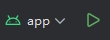
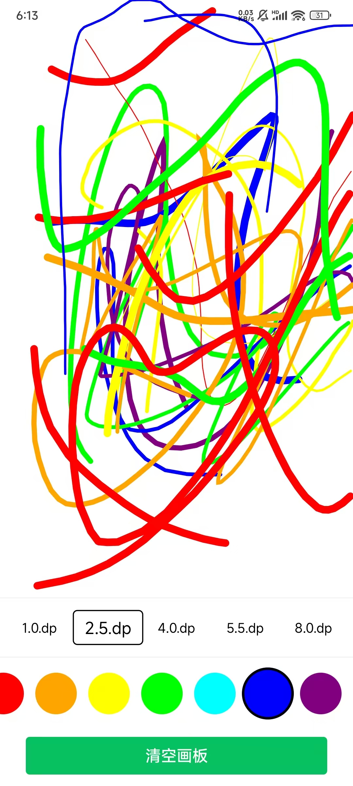
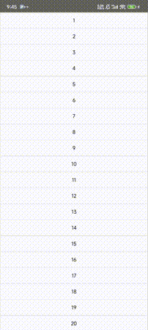
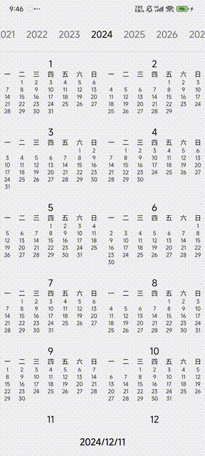
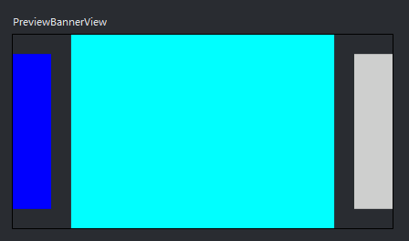
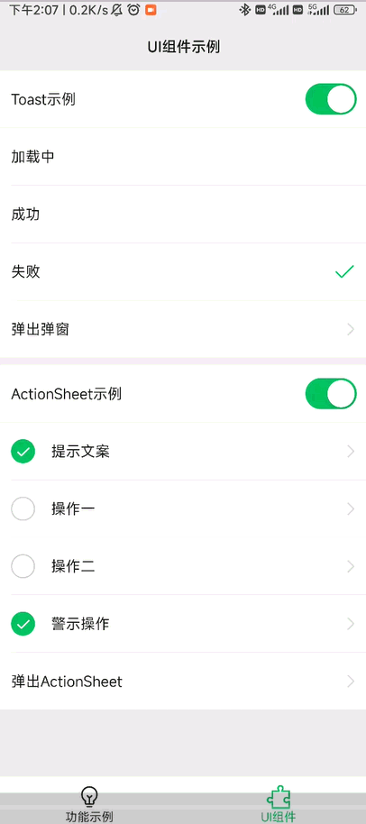
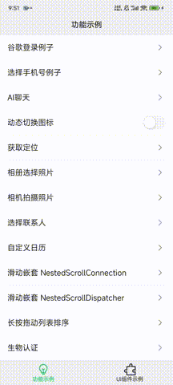

# Quickly-Use-Jetpack-Compose

简单易用的 Jetpack Compose 快速开发框架,以Compose的方式实现功能.如果觉得对您有帮助,请为项目点个star,感谢!项目会大量使用高版本安卓新增的功能.

# 协议

[查看隐私协议](PRIVACY.md)

# 架构

Quickly-Use-Jetpack-Compose
使用了大部分架构组件,但并没有完全遵守[官方架构指南](https://developer.android.com/topic/architecture?hl=zh-cn).

## 架构组件

+ 模块化,多module,插件化管理依赖.
+ 依赖注入,使用hilt进行依赖注入.
+ 单Activity架构,使用Navigation进行导航.
+ Compose+ViewModel+Flow(MVI),使用协程进行异步操作的反应式ui.

# 设计系统

自定义的设计系统,不使用M3的风格,按WX的UI风格设计的一套ui系统,有白天和夜间两种颜色模式,也可以添加更多颜色模式.

## Theme

+ 竖屏以375宽度适配屏幕,横屏不适配正常显示.
+ WeTheme: 替代MaterialTheme.
+ WeColorScheme: 定义颜色.
+ WeTypography: 定义字体.
+ WeIndication: 定义触摸效果.
+ WeDimen: 定义尺寸.
+ WeIcons: 使用ImageVector绘制图标.
+ WeWidget: 实现WX风格的组件,如顶部导航,底部导航,Button,Toast,ActionSheet,单选,多选,开关等组件.

# Module目录简介

+ app: 程序的入口,把各个module关联起来,组成一个完整的app,Navigation也在这里统一处理.
+ build-logic: 自定义的插件都放在这里,统一管理依赖.
+ core-logic: 逻辑模块,如本地数据库,远程服务器,身份认证,语言切换等.
+ core-ui: 设计系统,不一定按照M3的设计风格,可以自定义设计系统,编写通用的UI组件.
+ feature: 功能模块,按程序功能分成多个module,每个module都由Route,Screen,ViewModel,UiState,Action组成.
+ flavor: 区分flavor,根据不同的flavor引入不同的module,不同的module里再引入入不同的包.
+ res: 资源文件,统一管理图片,文字等资源文件.

# 已提供的示例代码

+ ktor: 序列化,ViewModel+Flow,等待响应,异常处理.
+ firebase: 埋点,崩溃分析,推送.
+ google登录: CredentialManager添加登录选项.
+ 离线可用: 优先从Room数据库获取数据,网络获取数据后更新到数据库.
+ ai聊天: 接入Google Ai模仿微信的聊天效果,联系人列表,聊天消息推送等.
+ 焦点控制: 点击焦点,键盘输入焦点控制,简化用户操作.
+ 动态切换logo: 比如双十一活动需要修改logo,但是又不想更新包.
+ 获取定位: 针对粗略和精准的权限,使用不同的方式获取定位.
+ launcher: 不需要申请权限的情况下,选择相册,拍摄照片,选择通讯录等.
+ 自定义日历: 使用Calendar获取时间,完全自定义日历.
+ 滑动嵌套: 处理compose中的滑动嵌套问题.
+ Lazy列表排序: 长按后拖动,对列表进行排序.
+ 生物认证: 通过指纹或锁屏密码进行生物认证.
+ 绘画画板: 选择线条宽度和颜色,绘制到屏幕上.
+ 视频下载播放: 使用youtubedl进行万能视频下载,使用media3进行视频播放.
+ WebView: 在Compose中使用WebView,添加一些常用的WebView功能.
+ 多语言: 动态切换多语言,支持SDK33的应用首选语言.

# 开发/发布环境

保证最新版Android Studio可用,但不保证旧版可用.
 在Android Studio更新时,项目也会更新,我会持续把学到的新知识更新到本仓库.

## 运行

确保切换到app,点击运行按钮.

## 密钥

密钥文件存放在根目录的**keystore**目录中.
 密钥配置在**ApplicationConventionPlugin.kt**文件中.

## 打包

使用了productFlavors,可以在Build Variant中选择不同的打包信息.
 bundleRelease打包aab.
 assembleRelease打包apk.

## 运行效果(gif比较模糊)

| 例子        | 截图                                                             |
|-----------|----------------------------------------------------------------|
| 绘画画板      |          |
| 多语言       |         |
| Lazy列表排序  |               |
| 自定义日历     |      |
| 动态切换logo  |          |
| Ai聊天,推送   |                 | 
| 网络异常处理    |             |
| 轮播图       |             |
| 组件示例      |           |
| 定位、图片、联系人 |  |

## Star History

