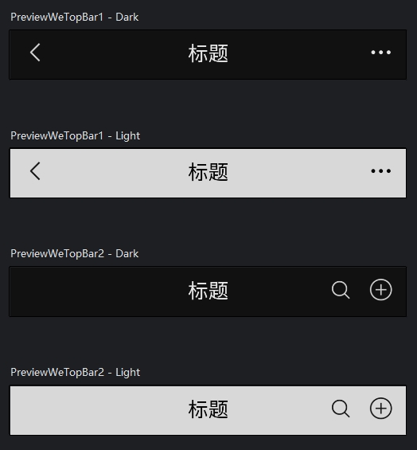
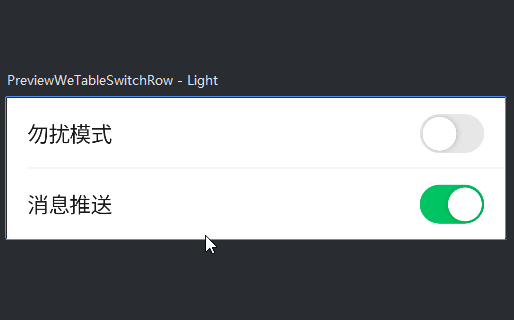
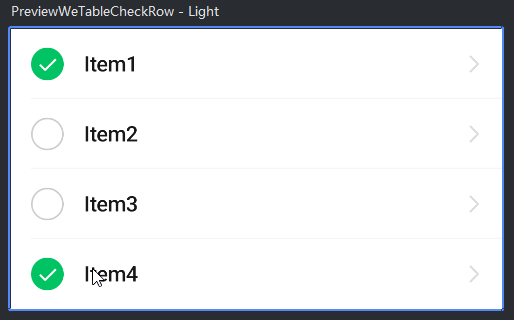
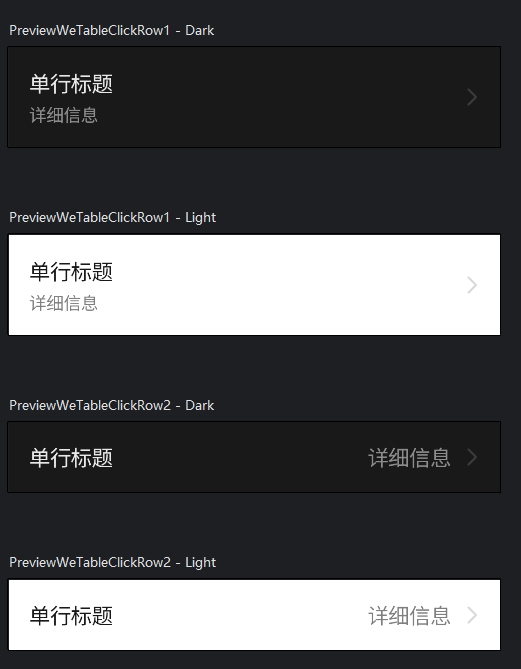
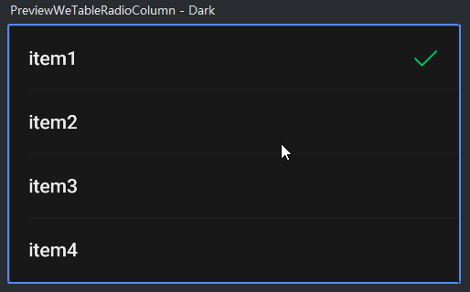
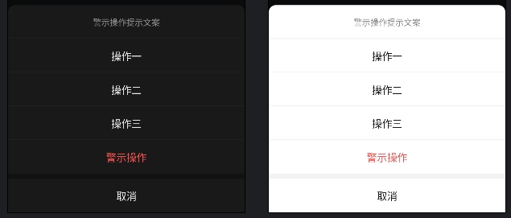
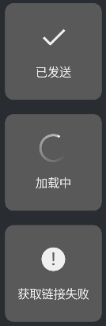
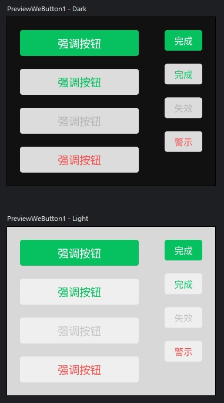

# Quickly-Use-Jetpack-Compose
简单易用的 Jetpack Compose 快速开发框架,以Compose的方式实现功能.

# 架构
Quickly-Use-Jetpack-Compose 使用了大部分架构组件,但并没有完全遵守[官方架构指南](https://developer.android.com/topic/architecture?hl=zh-cn).
## 架构组件
+ 模块化,多module,插件化管理依赖.
+ 依赖注入,使用hilt进行依赖注入.
+ 单Activity架构,使用Navigation进行导航.
+ Compose+ViewModel+Flow(MVI),使用协程进行异步操作的反应式ui.

# Module目录简介
+ app: 程序的入口,把各个module关联起来,组成一个完整的app.
+ build-logic: 自定义的插件都放在这里,统一管理依赖.
+ core-logic: 数据处理,与本地数据库或远程服务器交互.
+ core-ui: 设计系统,不一定按照M3的设计风格,可以自定义设计系统,编写通用的UI组件.
+ feature: 功能模块,按程序功能分成多个module,每个module都由Screen,ViewModel,Navigation组成.
+ res: 资源文件,统一管理图片,文字等资源文件.

# We设计系统
自定义的设计系统,不使用M3的风格,按WX的UI风格设计的一套ui系统.
## Theme
+ 竖屏以375宽度适配屏幕,横屏不适配正常显示.
+ WeTheme: 替代MaterialTheme.
+ WeColorScheme: 定义颜色.
+ WeTypography: 定义字体.
+ WeIndication: 定义点击效果,仿WX点击效果.
+ WeDimen: 定义尺寸.
+ WeIcons: 使用ImageVector绘制图标.

## Widget
| 组件 | 截图 |
|---------|---------|
| WeTopBar | </img> |
| WeTableSwitchRow | </img> |
| WeTableCheckRow | </img> |
| WeTableClickRow | </img> |
| WeTableRadioRow | </img> |
| WeActionSheet | </img> |
| WeToast | </img> |
| WeButton | </img> |
目前只实现了一部分WX组件,还在持续更新中...

# 已提供的示例代码
+ firebase: 埋点,崩溃分析,推送.
+ ktor: 序列化,ViewModel+Flow,等待响应,异常处理.
+ google: 登录最佳实践,CredentialManager添加登录选项.
## 运行效果
| 例子     | 截图                                                        |
|--------|-----------------------------------------------------------|
| 网络异常处理 | </img> |
| 组件示例   | </img> |

# 开发/发布环境
保证最新版Android Studio可用,但不保证旧版可用.
 在Android Studio更新时,项目也会更新,我会持续把学到的新知识更新到本仓库.
## 运行
确保切换到app,点击运行按钮.

## 密钥
密钥文件存放在根目录的**keystore**目录中.
 密钥配置在**ApplicationConventionPlugin.kt**文件中.
## 打包
bundleRelease打包aab.
 assembleRelease打包apk.